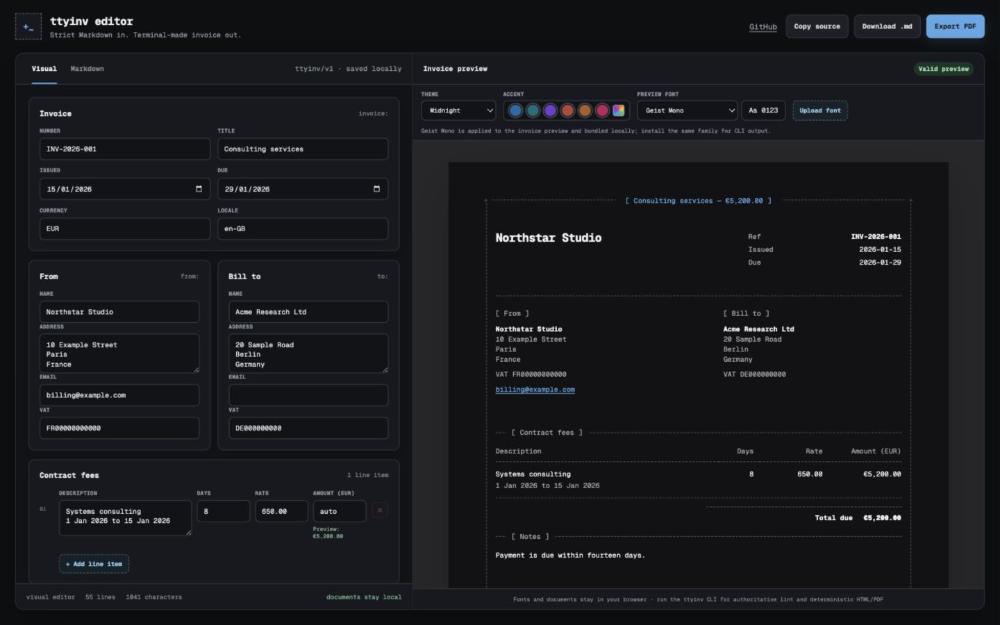
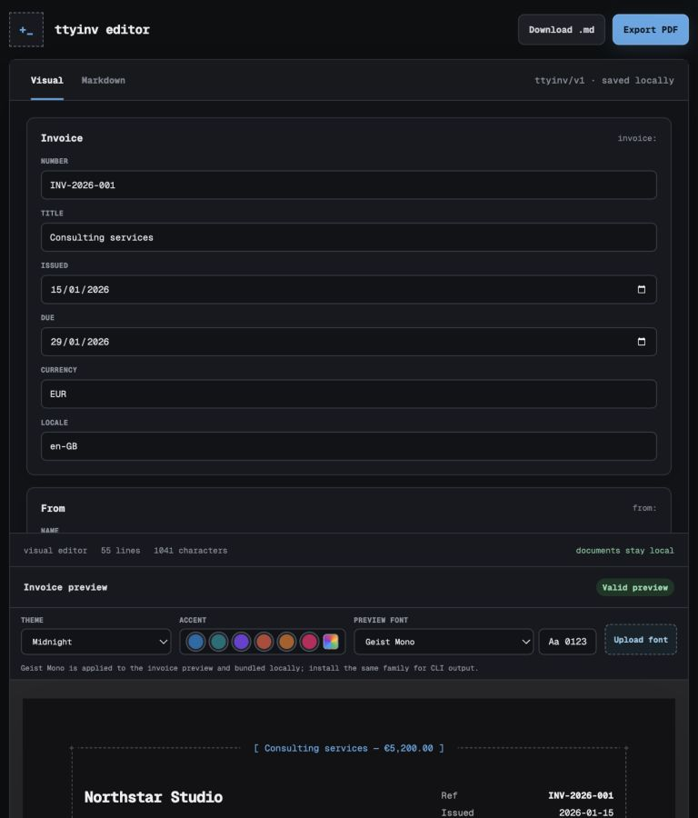
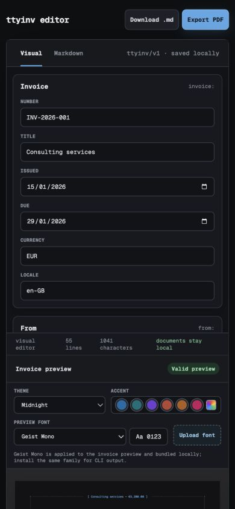

# ttyinv

`ttyinv` is a local-first invoice tool. Its compatibility renderer currently renders a strict Markdown invoice into a terminal-inspired, self-contained HTML document and/or an A4 PDF. The Rust engine currently validates invoices.

```text
invoice.md  →  validated invoice model  →  HTML/CSS  →  HTML and Chromium PDF
```

The CLI is intentionally **an invoice renderer, not an invoice-management system**. It has no login, database, customer directory, email delivery, payment collection, live exchange-rate lookup, or jurisdiction-aware tax engine.

> All examples in this repository are fabricated. Never commit a real invoice, signature, customer record, tax identifier, or payment coordinate.

## Highlights

- strict `ttyinv/v1` Markdown dialect: YAML frontmatter, H2 sections, GFM tables, prose, and links;
- light, print-friendly A4 output by default, with a geometry-identical dark theme;
- self-contained HTML with CSS, selected fonts, logos, and signatures embedded;
- Playwright/Chromium PDF output from the same HTML renderer;
- compatibility renderer: automatic decimal-safe line amounts, section totals, and total due;
- compatibility renderer: explicit amount support with safe mismatch handling;
- one payable currency plus informational source-currency columns;
- typed Payment, settlement, and signature sections;
- exact outer-page frame geometry and borderless tables aligned to a common column grid;
- installed monospace font selection, with Geist Mono as the canonical default;
- arbitrary safe accent colors and optional paper/ink/muted overrides;
- source-aware lint errors, local-path sandboxing, accessibility improvements, and pagination checks;
- deterministic output mode for release and regression artifacts.

## Browser editor



| Tablet layout | Mobile layout |
| --- | --- |
|  |  |

Use the hosted editor at https://app.ttyinv.com for browser-based authoring and preview. It supports visual and raw Markdown modes, a responsive A4 preview, signatures, document themes (including neutral Paper White), UI-wide accents, a movable ASCII frame, bundled monospace fonts, local font and signature-image uploads, and source download. Editor content and uploads stay in the browser. A $10 lifetime unlock enables PDF export, which uses the theme currently shown in the preview.

### Agent API and MCP

Token holders can call the hosted REST and MCP endpoints:

- `POST /api/v1/invoices` to turn structured fields into validated, portable `ttyinv/v1` Markdown;
- `POST /api/v1/invoices/validate` to validate existing source; or
- the Streamable HTTP MCP endpoint at `/mcp`, which exposes `create_invoice` and `validate_invoice`.

See the [hosted service documentation](https://app.ttyinv.com/docs) for authentication and current endpoint details.

## Install for development

Python 3.11 or newer is required for the compatibility renderer and test suite.

```console
git clone https://github.com/kaygdotorg/ttyinv.git
cd ttyinv
make install
. .venv/bin/activate
python -m playwright install chromium
```

The source repository does not casually commit font binaries. `make visual` obtains the canonical Geist Mono assets from their official source and preserves their license for the local build.

### Rust validation CLI

The Rust CLI provides the local validation slice. It does not render invoices yet. Rust rendering is planned.

The planned Rust PDF path will use `krilla` 0.8.2. It measured byte-deterministic in-process and across processes. The rejected alternative failed that test and could not pin document identifiers.

One Rust engine owns every invoice rule. The native CLI, WebAssembly, REST, and MCP surfaces are adapters to that engine. The Python and TypeScript engines are temporary references pending deletion.

Use Nix when Rust tools are not installed:

```console
nix shell nixpkgs#rustc nixpkgs#cargo -c cargo check --workspace
nix shell nixpkgs#rustc nixpkgs#cargo -c cargo build --workspace --release
make parity
```

Cargo crates are build dependencies only. A released Rust binary has no project runtime dependency. It does not require Python, Node.js, Chromium, Playwright, a package manager, or network access.

## Quick start

Create a fabricated starter invoice:

```console
ttyinv init invoice.md
ttyinv init invoice.md --with-assets
```

`--with-assets` also creates fabricated `assets/logo.svg` and
`assets/signature.svg` files referenced by the starter. `init` uses only static
example data; it never reads identity, account, or locale data from the
environment.

Render the default light A4 PDF beside it:

```console
ttyinv invoice.md
```

Render self-contained HTML, or both formats:

```console
ttyinv invoice.md --format html
ttyinv invoice.md --format both
```

The explicit command is equivalent:

```console
ttyinv render invoice.md --format both
```

Choose an output path or stem:

```console
ttyinv invoice.md --output ./build/invoice
ttyinv invoice.md --format html --output ./build/invoice.html
```

## Example invoice

```md
---
schema: ttyinv/v1
invoice:
  number: INV-2026-001
  title: Consulting services
  issued: 2026-01-15
  currency: EUR
  due: 2026-01-29
  locale: en-GB

from:
  name: Northstar Studio
  address:
    - 10 Example Street
    - Paris
    - France
  identifiers:
    VAT: FR00000000000
  email: billing@example.com

to:
  name: Acme Research Ltd
  address:
    - 20 Sample Road
    - Berlin
    - Germany
  identifiers:
    VAT: DE000000000

payment:
  title: Payment
  methods:
    - title: Bank transfer
      fields:
        Beneficiary: Northstar Studio
        Reference: INV-2026-001
        Instructions: Contact billing@example.com for transfer details
---

## Contract fees

| Description | Days | Rate | Amount (EUR) |
| --- | ---: | ---: | ---: |
| Systems consulting<br>1 Jan 2026 to 15 Jan 2026 | 8 | 650.00 | auto |

## Notes

Payment is due within fourteen days.
```

Every H2 followed by a GFM table becomes a titled invoice section. H2 prose sections, such as Notes, remain prose. `<br>` inside a table cell creates the reference design's primary line plus muted detail line.

The v1 schema accepts optional `invoice.kind` with `standard` or `gst`. It rejects `invoice.reference`, `logo_alt`, and signature `alt`. It rejects authored `appearance.theme`. `appearance.font` is an object with optional `family`, `regular`, and `bold` fields. `appearance.rule` is supported. `payment.pageBreakBefore` is supported.

## Calculations and explicit amounts

The Python compatibility renderer currently enforces the documented money rules. Rust support is planned. The Rust `validate` command does not parse quantity, rate, or amount cells. It accepts incomplete `auto`, non-numeric amount cells, and explicit mismatches.

For the planned Rust rules, a blank or `auto` amount uses recognized quantity and rate columns:

```text
line amount = quantity × unit price
```

Recognized quantity aliases include `Qty`, `Quantity`, `Days`, `Hours`, and `Units`. Recognized price aliases include `Rate`, `Unit price`, and `Price`.

The planned Rust adapter flags are mutually exclusive:

```console
ttyinv invoice.md --trust-explicit  # planned Rust option
ttyinv invoice.md --recalculate     # planned Rust option
```

The Rust adapter currently rejects both flags. The Python compatibility renderer supports them today.

Current Rust validation example:

```console
ttyinv validate invoice.md
# invoice.md: error[SCHEMA003]: invoice.currency is required
```

## Multi-currency

One currency is payable per invoice:

```yaml
invoice:
  currency: EUR
```

A section may include informational source-currency values and an explicitly converted payable column:

```md
| Description | Amount (JPY) | Amount (EUR) |
| --- | ---: | ---: |
| Airport rail | 4200 | 25.90 |
```

`ttyinv` does not contact an exchange-rate service. The payable conversion is authored explicitly.

## Themes, fonts, color, and density

Light is the default for print:

```console
ttyinv invoice.md --theme light
ttyinv invoice.md --theme dark
```

The two themes share page measurements, typography metrics, table grids, frame geometry, and pagination. Only design tokens change.

Set an accent:

```console
ttyinv invoice.md --accent '#ff6b57'
ttyinv invoice.md --accent 'oklch(70% 0.14 220)'
```

Override the remaining palette deliberately:

```console
ttyinv invoice.md \
  --paper '#fffdf8' \
  --ink '#181714' \
  --muted '#77736b' \
  --accent '#1268a8'
```

Unsafe CSS expressions are rejected. `ttyinv lint` warns when parseable colors have weak text/background contrast.

List verified installed monospace fonts and select one:

```console
ttyinv fonts
ttyinv --list-fonts
ttyinv invoice.md --font 'Maple Mono NF'
```

The CLI inspects real font tables instead of trusting a family name. A proportional font is rejected. The chosen font is embedded into self-contained output; the recipient does not need it installed. Geist Mono remains the canonical default when it is bundled or installed.

Use a tighter layout without changing the design system:

```console
ttyinv invoice.md --density compact
```

## Lint before rendering

```console
ttyinv lint invoice.md
ttyinv lint invoice.md --strict
ttyinv lint invoice.md --json
```

The compatibility renderer's lint checks:

- YAML syntax, duplicate keys, and required schema fields;
- Markdown table shape and source line numbers;
- amount parsing and arithmetic mismatches;
- likely pagination pressure and unusually long cells;
- missing assets and, optionally, local document links;
- path traversal outside the invoice directory;
- basic palette contrast.

The Rust `validate` command does not parse quantity, rate, or amount cells. See [`SPEC.md`](SPEC.md) for the planned Rust money rules.

Diagnostics use twelve fields: `severity`, `code`, `message`, `path`, `field_path`, `line`, `column`, `hint`, `section`, `section_index`, `row`, and `column_name`. Optional JSON fields are omitted when they do not apply; they are not emitted as `null`. `field_path` uses the canvas path grammar. Warnings print and leave the document valid. The Rust adapter also emits `INPUT001` for unreadable or non-UTF-8 input and `INPUT002` when input exceeds `MAX_SOURCE_BYTES`.

Verify linked local documents too:

```console
ttyinv lint invoice.md --require-link-targets
```

## Assets, links, and security

Relative assets are resolved from the source Markdown file's directory. By default, an asset or local file link that resolves outside that directory—including through a symlink—is rejected.

```console
ttyinv invoice.md --allow-outside-root
```

Use that flag only for trusted input. Remote assets are never fetched by the renderer.

Web, `mailto:`, and fragment links remain clickable. Relative document links are rewritten for HTML and emitted on a best-effort basis in PDF because viewers apply different local-file security policies.

See [`docs/SECURITY.md`](docs/SECURITY.md).

## Pagination and accessibility

The generated HTML uses semantic tables, scoped column headings, accessible table captions, a document landmark, link semantics, and sensible image alt text defaults. The renderer attempts to:

- repeat table headings after a page break;
- avoid splitting invoice rows;
- keep section titles with their tables;
- keep totals, Payment methods, and signatures together where practical;
- preserve the complete page frame on every A4 page.

The visual regression contract tests relationships rather than committing a private screenshot: frame junctions share exact axes with rules; table rules and totals share a grid; section labels share one inset; and the page keeps A4 geometry.

## Deterministic output

```console
ttyinv invoice.md --format both --deterministic
```

Deterministic mode removes volatile HTML metadata and normalizes PDF metadata and document IDs. Reproducibility still depends on using the same source, selected font files, Playwright/Chromium revision, and platform rendering environment. Release builds pin Playwright in `constraints-release.txt`.

## JSON Schema

Print or write the public frontmatter schema:

```console
ttyinv schema
ttyinv schema --output ttyinv-v1.schema.json
```

The Markdown grammar and compatibility policy are defined in [`SPEC.md`](SPEC.md).
Schema output is deterministic: keys are sorted, Unicode is emitted as UTF-8,
line endings are LF, and the document ends with one newline.

## Exit codes

The CLI uses these process exit codes:

| Code | Meaning |
| --- | --- |
| `0` | Success |
| `1` | Document invalid because one or more error diagnostics were emitted |
| `2` | Usage error |
| `3` | Input error: unreadable input, non-UTF-8 input, or input above the size bound |
| `4` | Output error: the CLI cannot write the requested output |
| `5` | Reserved for render failure; unused until rendering lands |
| `70` | Internal error |

A document can contain several failure classes at once. Therefore, a failure class belongs in the diagnostic code and never in one exit status. The exit status reports only the process-level result.

## Development and privacy

```console
make install
make check
make visual
make build
make rust-check
make rust-release
make parity
```

`make check` runs unit tests, fabricated-invoice linting, the privacy gate, and schema validation. `make visual` installs Chromium, obtains canonical Geist Mono assets locally, renders the fabricated golden invoice, and checks relational geometry. `make parity` compares every conformance case with the Python reference CLI and the Rust validation CLI.

The repository must never contain a real invoice or identifying data. Read [`PRIVACY.md`](PRIVACY.md) and [`CONTRIBUTING.md`](CONTRIBUTING.md) before adding fixtures.

## License

Code is licensed under **AGPL-3.0-only**. Third-party fonts and other assets retain their own licenses.
